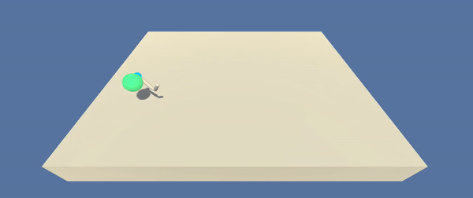
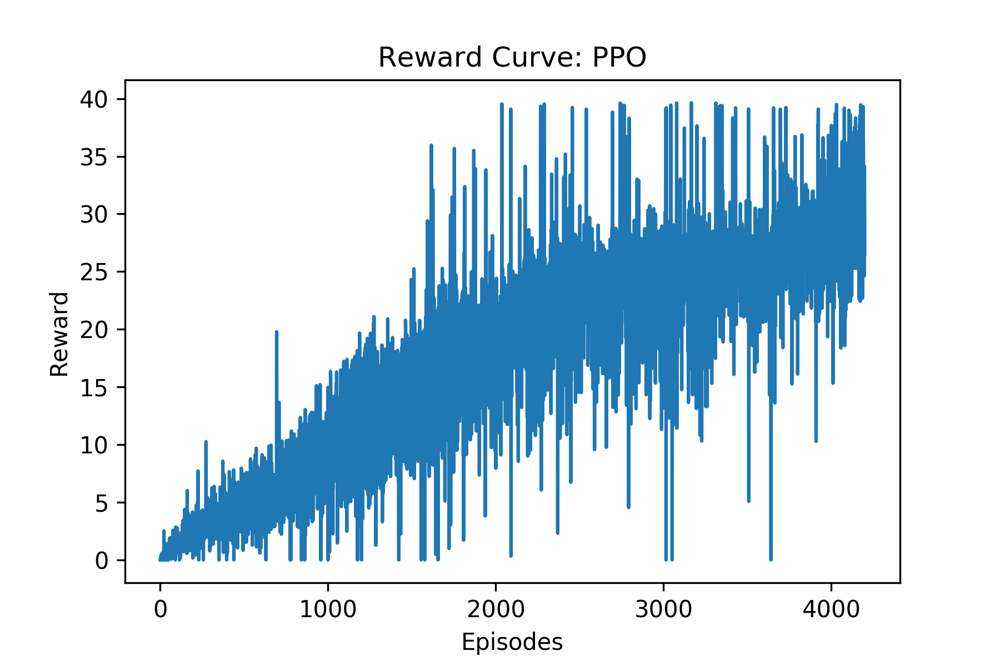
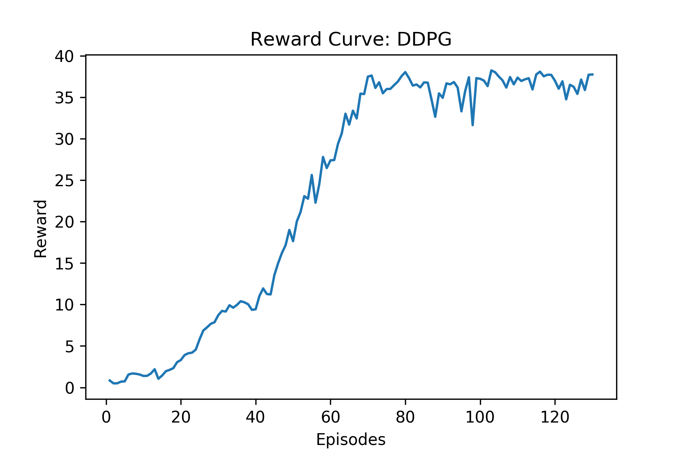

# About
Train double-jointed arms to reach target locations using Proximal Policy Optimization ([PPO](https://arxiv.org/pdf/1707.06347.pdf)) in Pytorch

## Table of Contents

* [Agent Output Demo](#agent-output-demo)
  - [single agent](#single-agent)
  - [Multiple Agents](#multiplt-agents)
* [Reacher Environment](reacher-environment)
* [Setup](#setup)
    * [System Configuration](#system-configuration)
    * [Environment Setup](#environment-setup)
    * [Instructions for getting started](#instructions-for-getting-started)
    * [Project Structure](#project-structure)
* [Reward Curve](#reward-curve)
* [Distributed Training](#distributed-training)

## Agent Output Demo

#### Single Agent


#### Multiple Agents


## Reacher Environment
* Set-up: Double-jointed arm which can move to target locations.
* Goal: The agents must move it's hand to the goal location, and keep it there.
* Agents: The environment contains 10 agent linked to a single Brain.
* Agent Reward Function (independent): 
  * +0.1 Each step agent's hand is in goal location.
* Brains: One Brain with the following observation/action space.
  * Vector Observation space: 26 variables corresponding to position, rotation, velocity, and angular velocities of the two arm Rigidbodies.
  * Vector Action space: (Continuous) Size of 4, corresponding to torque applicable to two joints.
  * Visual Observations: None.
* Reset Parameters: Two, corresponding to goal size, and goal movement speed.
* Benchmark Mean Reward: 30


# Setup

## System Configuration
The project was built with the following configuration:

* Ubuntu 16.04
* CUDA 10.0
* CUDNN 7.4
* Python 3.6 (currently ml-agents unity package does not work with python=3.7)
* Pytorch 1.0

Though not tested, the project can still be expected to work out of the box for most reasonably deviant configurations.

## Environment Setup

* Create separate virtual environment for the project using the provided `environment.yml` file
```
conda create -f environment.yml
conda activate reacher
```

## Instructions for getting started!

1. Clone the repository (if you haven't already!)
```bash
git clone https://github.com/1jsingh/rl_reacher.git
cd rl_reacher
```

2. Download the environment from one of the links below.  You need only select the environment that matches your operating system:

    
    - Linux: [click here](https://drive.google.com/open?id=1bYnxylT-8w3f4kp1Sdh-njjJ8pR1CerH)
    - Mac OSX: [click here](https://drive.google.com/open?id=1ZkONgq-RN6MTzEv7Y_Y9r3jv7aWZdc65)

    (_For AWS_) If you'd like to train the agent on AWS (and have not [enabled a virtual screen](https://github.com/Unity-Technologies/ml-agents/blob/master/docs/Training-on-Amazon-Web-Service.md)), then please use [this link](https://drive.google.com/open?id=1q9HEMJVIOyKlSFg46l0Mgg3tQI4ovJ8w) to obtain the "headless" version of the environment.  You will **not** be able to watch the agent without enabling a virtual screen, but you will be able to train the agent.  (_To watch the agent, you should follow the instructions to [enable a virtual screen](https://github.com/Unity-Technologies/ml-agents/blob/master/docs/Training-on-Amazon-Web-Service.md), and then download the environment for the **Linux** operating system above._)
       
3. Place the downloaded file in the `unity_envs` directory and unzip it.
  ```
  mkdir unity_envs && cd unity_envs
  unzip Reacher_Linux.zip
  ```

4. Follow along with `Reacher-ppo.ipynb` or `Reacher-ddpg.ipynb` to train your own RL agent. 


## Project Structure
* `model.py`: code for actor and critic class
* `ddpg.py`: DDPG agent with experience replay and OU Noise
* `Reacher-ppo.ipynb`: notebook for training PPO based RL agent
* `Reacher-ddpg.ipynb`: notebook for training DDPG based RL agent
* `unity_envs`: directory for Reacher unity environments
* `trained_models`: directory for saving trained RL agent models

## Reward Curve
* PPO agent
  
* DDPG agent
  

***Note: DDPG has higher sample efficiency than PPO***

## Distributed Training

The environment consists of 20 parallel agents which is useful for algorithms like [PPO](https://arxiv.org/pdf/1707.06347.pdf), [A3C](https://arxiv.org/pdf/1602.01783.pdf), and [D4PG](https://openreview.net/pdf?id=SyZipzbCb) that use multiple (non-interacting, parallel) copies of the same agent to distribute the task of gathering experience.
